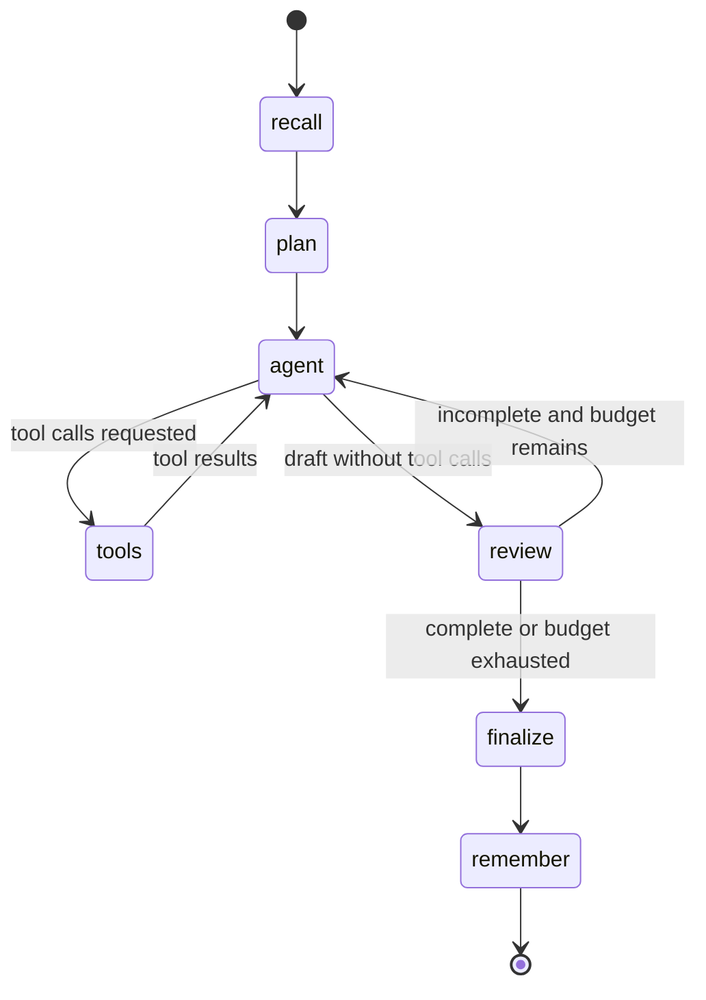

# Atlas Agent architecture

## Design goal

Atlas is designed to complete multi-step knowledge-work tasks while keeping orchestration visible, state durable, tool effects bounded, and evidence distinguishable from model prose. The same runtime serves the CLI, FastAPI endpoints, SSE task workspace, tests, and LangGraph Studio export.

## Runtime flow

| Node | Responsibility | Typed boundary |
| --- | --- | --- |
| `recall` | Vector-similarity search in one user's memories | `list[str]` injected as untrusted context |
| `plan` | Decompose task into ordered, testable steps | `TaskPlan` and `PlanStep` Pydantic schemas |
| `agent` | Select the next tool or produce a draft | LangChain `AIMessage` and tool calls |
| `tools` | Execute the registered tool contract | LangGraph `ToolNode`; JSON result messages |
| `review` | Check the transcript against the original task | `ReviewDecision` schema |
| `finalize` | Produce the answer from confirmed evidence | `AIMessage`; sources/artifacts passed separately |
| `remember` | Curate a small set of durable memories | `MemoryExtraction` and `MemoryCandidate` schemas |

Conditional edges implement a bounded actor/tool loop and a bounded reviewer/revision loop. If the action budget is exhausted, the actor receives `allow_tools=False`. If the review budget is exhausted, the graph finalizes with the review state it has instead of looping indefinitely.

Workflow termination is not conflated with task success. The public runtime reports `partial` when the final review remains incomplete; only a plan-consistent completed review produces `completed` and permits long-term memory curation.

## Durable state

`AsyncSqliteSaver` checkpoints every graph super-step with synchronous durability. A public `(user_id, thread_id)` pair is converted to a SHA-256-derived checkpoint namespace, preventing two users who choose the same thread label from sharing state. Reusing the same pair appends to the durable conversation; a new pair starts cleanly.

Risky tools call LangGraph `interrupt()`. The graph persists before returning an `interrupted` result. `/api/resume`, the SSE resume route, and the CLI approval loop continue with `Command(resume=...)`, so tool execution never depends on an in-memory web request staying alive.

Every approval carries LangGraph's opaque interrupt ID. The runtime re-reads the pending checkpoint under a per-user/thread guard and rejects a stale, duplicate, or mismatched decision before using an ID-keyed resume map. The guard combines an in-process async lock with a tenant-scoped file lock, so separate local runtime processes sharing one data directory cannot lose same-thread checkpoints. New work cannot supersede a paused thread. A multi-host deployment must replace this local coordination boundary with a distributed lock or transactional managed checkpointer.

The CLI, API, and direct Python callers all enter through the same Pydantic request limits for messages, user namespaces, thread IDs, and approval payloads. This prevents a library or CLI path from bypassing the API's resource bounds.

### Browser-local recent work

The web workspace keeps a small versioned recent-task index in browser `localStorage` under `atlas-recent-tasks-v2`. It stores only the task reference, local profile, display title or excerpt, plain-language status, and updated time needed to render and reopen up to eight recent entries per profile. Malformed records are discarded, entries are de-duplicated by thread, and the oldest shortcut falls away when the bound is reached.

This index is deliberately separate from durable state. SQLite checkpoints remain authoritative for messages, plans, results, interrupts, and resume behavior. Browser storage does not synchronize between devices, establish identity, authorize a thread, or preserve the transcript. Clearing it removes navigation convenience, not the task checkpoint, saved vector records, or workspace artifacts.

## Memory

Atlas separates two concerns that are often incorrectly collapsed:

1. **Thread memory** is the exact state and message history held in SQLite checkpoints.
2. **Saved vector memory** is a separate SQLite index for curated cross-thread preferences, facts, project context, and constraints.

The local index hashes normalized word, word-pair, and character features into deterministic vectors
and ranks them by cosine distance. It is network-free and useful for lightweight similarity recall;
it is not a claim of model-level semantic understanding. Records carry `user_id`, source thread,
category, importance, and timestamp. Every list/search/delete operation filters by user. Stable IDs
upsert duplicate content. A redaction pass removes common key, bearer-token, and private-key
patterns before vectorization or persistence; a fully sensitive candidate is dropped.

## Model boundary

`LangChainBrain` exposes five roles through one provider-neutral chat model:

- planner with structured output;
- tool-bound actor;
- structured reviewer;
- finalizer;
- structured memory curator.

The client is initialized lazily. That lets health checks, API documentation, graph inspection,
and the UI load without pretending that incomplete model setup is ready. Readiness requires both
credential presence and the selected local provider integration; it never exposes a secret value
or claims the external provider is reachable.

All external content is wrapped as untrusted context. Model-generated sources or paths do not become evidence. `collect_evidence()` accepts URLs only from successful `web_search` tool results and artifacts only from successful `write_file` results.

## Tool layer

The registry constructs one injected bundle shared by the graph and tests:

- calculator: AST-based numeric evaluation with approved functions and bounds;
- web search: Tavily when keyed, DDGS otherwise, with normalized URLs and field-level compaction that keeps at least one source inside the output budget;
- file tools: one owned workspace root, safe resolution, hidden/symlink rejection, bounded reads/searches, atomic no-clobber creates, and fingerprint-bound replacements inside canonical per-path cross-process locks;
- Python: source AST policy (including structural-pattern rejection), human approval, isolated environment, budgets, and a Docker-only application backend.

Tools return bounded JSON so the model can reason over status without receiving raw exception details or unlimited output.

### Read-only workspace access

The task workspace exposes generated artifacts through three local FastAPI routes that reuse the injected `WorkspaceFiles` service:

| Route | Browser capability | Boundary |
| --- | --- | --- |
| `GET /api/workspace` | List files and directories | Relative path/pattern, bounded result count, hidden and symlink rejection |
| `GET /api/workspace/file` | Preview one UTF-8 text file | Existing read cap, root confinement, no content execution |
| `GET /api/workspace/download` | Download one file | Existing file-size cap, attachment disposition, `nosniff` response |

Expected traversal and invalid-path failures become concise 400 responses; missing entries return 404; oversized downloads return 413; and an injected runtime without a workspace returns 503. These errors do not disclose the absolute workspace root. The UI can list, preview, copy, and download, but it cannot edit, rename, delete, execute, or upload artifacts.

This is a safe read surface for the completed local application, not a public authorization boundary. The current client-provided profile does not establish ownership. Public hosting must derive identity server-side and authorize the workspace, thread, and memory surfaces together.

## Interfaces

The web interface is a responsive task workspace with three desktop regions: recent work and progressively disclosed settings, the task/plan/result canvas, and supporting activity/files/saved context. At narrower widths those regions reflow into a conventional compact task flow. Model and graph terminology is kept under Workspace settings or Engineering details so the default surface answers what can be done, what is happening, and what was produced.

The workspace uses the public SSE routes. A stream contains custom graph stage events, finalizer message chunks, an optional interrupt, and a canonical result. The browser translates those states into Ready, Working, Waiting for your decision, Complete, Needs review, or Couldn't finish without changing the underlying result contract. The synchronous routes expose the same result model for automation, and the Typer/Rich CLI owns the same runtime lifecycle and handles approvals interactively.

Risky tool interrupts render as a labelled dialog with a plain-language question, a conservative Don't allow action, an Allow once action, and raw scope behind an optional disclosure. The opaque interrupt ID and file-state token remain unchanged beneath that presentation. A disconnected browser therefore cannot turn a persisted decision point into approval.

The shell supports System, Light, and Dark themes using semantic tokens and a browser-local explicit preference. It includes a skip link, visible `:focus-visible` treatment, 44-pixel primary touch targets, one concise status announcer rather than token-by-token live output, reduced-motion behavior, forced-colors support, and responsive reflow down to 320 pixels. These source-level provisions still require rendered keyboard, assistive-technology, contrast, zoom, and viewport validation before making an accessibility conformance claim.

The UI and artifact APIs remain loopback-oriented and unauthenticated. Local source, automated, browser, and container evidence must not be summarized as hosted availability, production readiness, public tenant isolation, cross-device history, or live-provider reliability.

## Extension points

The concise [extension guide](../extending.md) is the source of truth for adding tools, explicit evidence extractors, model providers, memory backends, API routes, and browser features. Custom tool names use a validated identifier rather than a closed built-in list, and custom output never becomes cited source or artifact evidence without an extractor registered on the same `ToolBundle`.

Local SQLite can be replaced with a production checkpointer without changing public API models. Before public deployment, add authenticated tenant claims and use those claims—not request fields—as `user_id` across thread, workspace, and memory access.
